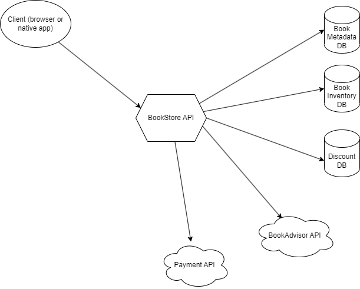

# Overview

This code base exists mostly as a support for a series of articles about acceptance testing. Feel free to toy with it if you like.

It is a website (front-end + back-end) written in C# that mimics an online book shop where you can browse through the catalog of 6 (!) books and add them to your cart, check it out and even pay for it.

There is also an implementation of the [Potter kata](https://codingdojo.org/kata/Potter/), only using a non-transphobic author and her work.

[The architecture is hexagonal](https://tpierrain.blogspot.com/2020/11/hexagonal-or-not-hexagonal.html), meaning there is a central module that contains all the business model and logic and that does not depend on other technical layers. Here is a diagram of the modules :

# How to make it work

The following projects must be launched :
- backend : `dotnet run --project src\BookShop.api`
- frontend : `dotnet run --project src\BookShop.web`
- reviews : `dotnet run --project third-parties\BookAdvisor`
- payment : `dotnet run --project third-parties\BookPal`

Then open a browser at https://localhost:7261

# Payment notes

In order for the payment to work, use one of those three credit cards :
- 4000 0000 0000 0000 : it's a "yes card", meaning the payment will always work without any further challenge.
- 4111 1111 1111 1111 : is a card with 3DS1-like challenge. You are redirected to another page where you are prompted for credentials. Enter "user" as user and "password" as password.
- 4222 2222 2222 2222 : is a card with 3DS2-like challenge. It work just like 3DS1-like challenge except that you are not redirected to a dedicated page, the credentials are displayed inside the checkout page.

Any other number will fail.

Once the payment is validated, a "Thank you" page is displayed with a summary of the order.

# Technical notes

Parts of this code are not exactly clean. The point is not to showcase our coding capabilities but make a playground to study different kinds of testing techniques.